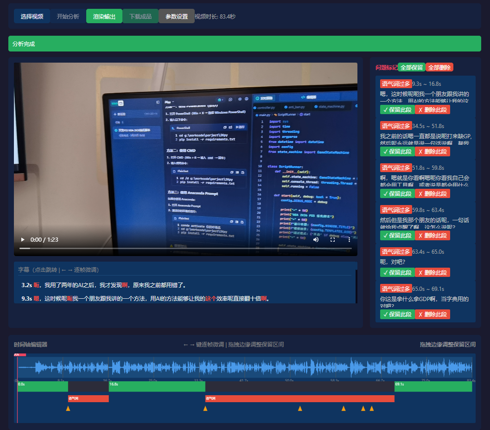
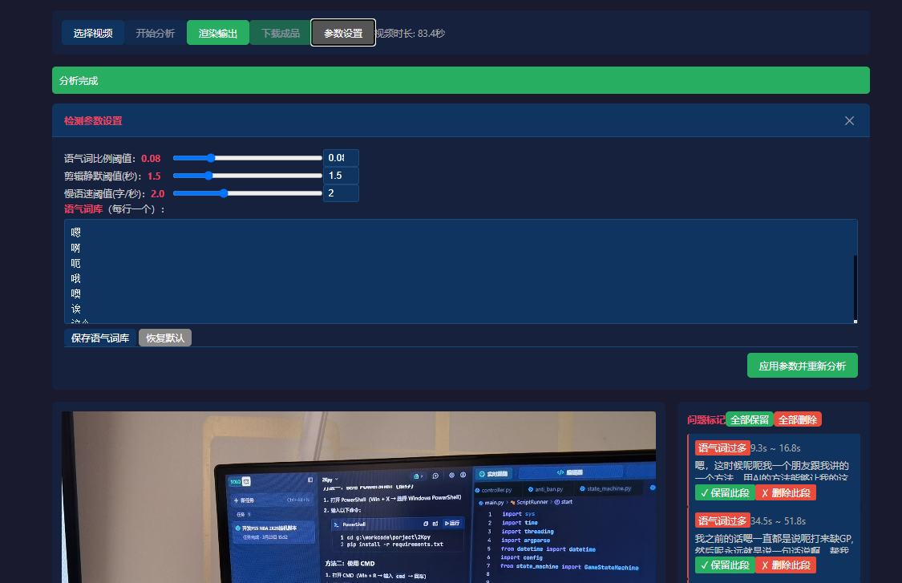

# TalkCut Local - 口播视频智能粗剪工作站

<p align="center">
  
  
  
  
</p>

<p align="center">
  <strong>本地化 · 智能化 · 可视化</strong><br>
  基于 FunASR 的口播视频自动粗剪工具，纯本地运行，数据安全无忧
</p>

---

## 📖 目录

- [项目简介](#项目简介)
- [核心特性](#核心特性)
- [技术架构](#技术架构)
- [快速开始](#快速开始)
- [使用指南](#使用指南)
- [API 文档](#api-文档)
- [配置说明](#配置说明)
- [项目结构](#项目结构)
- [开发文档](#开发文档)
- [常见问题](#常见问题)
- [贡献指南](#贡献指南)
- [许可证](#许可证)
- [致谢](#致谢)

---

## 项目简介

**TalkCut Local** 是一款面向口播视频创作者的智能粗剪工具。通过本地部署的 AI 语音识别引擎（FunASR），自动检测视频中的语气词、静默片段、语速异常等问题，并生成可视化的剪辑建议。用户可通过直观的时间轴界面进行微调，最终一键渲染输出精剪后的视频。

### 🎯 目标用户

- **自媒体创作者**：快速去除口播视频中的废话、停顿
- **视频剪辑师**：提高粗剪效率，减少重复劳动
- **内容团队**：标准化视频质量，统一剪辑风格

### ✨ 核心优势

- **🔒 纯本地运行**：所有数据处理均在本地完成，无需上传云端，保护隐私
- **🚀 智能分析**：基于 FunASR 高精度中文语音识别，自动标记问题片段
- **🎨 可视化编辑**：直观的时间轴界面，支持拖拽、微调、预览
- **⚡ 高效渲染**：基于 FFmpeg 无损拼接，快速输出成片
- **🎛️ 灵活配置**：参数可调节，适应不同剪辑风格

---

## 核心特性

### 1. 智能语音分析

- **高精度转录**：集成 FunASR Paraformer-large 模型，中文识别准确率高达 95%+
- **词级时间戳**：精确到每个字的起止时间，为精细剪辑提供依据
- **多维度检测**：
  - 语气词检测（嗯、啊、呃、这个、那个等）
  - 静默片段检测（可调节阈值）
  - 语速异常检测（过慢/过快）
  - 重复词检测（结结巴巴）

### 2. 可视化时间轴编辑器

- **波形图显示**：直观展示音频波形，快速定位问题区域
- **多轨道展示**：
  - 波形轨道：灰色波形 + 保留区间高亮
  - 剪辑轨道：绿色（保留）/ 灰色（删除），边缘可拖拽
  - 问题标签轨道：小旗标记，点击跳转
- **字幕滚动区**：当前句子高亮，点击跳转对应时间
- **键盘微调**：左右方向键逐帧精确调整剪辑点

### 3. 灵活的参数配置

- **实时调整**：界面滑块实时调整检测阈值
- **语气词库管理**：可视化查看和编辑语气词列表
- **一键重新分析**：调整参数后无需重新上传视频，一键重新分析

### 4. 高效的渲染输出

- **无损拼接**：基于 FFmpeg concat demuxer，避免重复编码
- **快速预览**：流媒体传输，无需等待完整渲染
- **一键下载**：渲染完成后一键下载成片

---
## 界面预览

### 主界面


### 时间轴编辑器


## 技术架构

### 系统架构图

```
┌──────────────────────────────────────────┐
│            浏览器（HTML5 GUI）            │
│  视频预览 | 时间轴 | 剪辑点拖拽 | 问题标签  │
└──────────────┬───────────────────────────┘
               │ HTTP (localhost:5199)
┌──────────────┴───────────────────────────┐
│          Flask Web 服务                   │
│  静态文件托管 | API 接口                  │
└──────────────┬───────────────────────────┘
               │ 调用
┌──────────────┴───────────────────────────┐
│         分析引擎 (analyze_talking_head)    │
│  FunASR 语音识别 | FFmpeg 音频分析 | 规则   │
└──────────────┬───────────────────────────┘
               │ 输出 project.json
┌──────────────┴───────────────────────────┐
│          渲染引擎 (ffmpeg concat)          │
│  无损流拼接，快速出片                      │
└──────────────────────────────────────────┘
```

### 技术栈

| 层级 | 技术 | 版本 | 说明 |
|------|------|------|------|
| **后端框架** | Flask | ≥2.3.0 | 轻量级 Web 服务 |
| **语音识别** | FunASR | ≥1.0.0 | 中文语音识别引擎 |
| **音频分析** | librosa + numpy | ≥0.10.0 | 音频特征提取 |
| **视频处理** | FFmpeg | - | 音频提取、视频拼接 |
| **深度学习** | PyTorch | ≥2.0.0 | FunASR 依赖 |
| **前端界面** | HTML5 + Canvas | - | 原生无框架，减少依赖 |
| **视频播放** | HTML5 Video API | - | 原生视频播放 |
| **异步请求** | Fetch API | - | 前后端通信 |

---

## 快速开始

### 环境要求

- **操作系统**：Windows 10/11、macOS 10.15+、Linux（Ubuntu 18.04+）
- **Python**：3.12 或更高版本
- **FFmpeg**：需要安装在系统 PATH 中
- **内存**：建议 8GB 以上（FunASR 模型加载需要）
- **存储**：至少 5GB 可用空间（模型缓存 + 临时文件）

### 安装步骤

#### 1. 克隆项目

```bash
git clone https://github.com/JiaJingLi/talkcut-local.git
cd talkcut-local
```

#### 2. 创建虚拟环境（推荐）

```bash
# Windows
python -m venv venv
venv\Scripts\activate

# macOS / Linux
python3 -m venv venv
source venv/bin/activate
```

#### 3. 安装依赖

```bash
pip install -r requirements.txt
```

> **注意**：首次安装会自动下载 FunASR 模型（约 1.2GB），请保持网络通畅。

#### 4. 启动服务

```bash
# 方法 1：直接运行
python app.py

# 方法 2：使用启动脚本（Windows）
.\启动.bat
```

#### 5. 访问界面

打开浏览器，访问 `http://127.0.0.1:5199`

---

## 使用指南

### 基本工作流程

```
上传视频 → 自动分析 → 查看问题 → 调整剪辑点 → 渲染输出
```

### 详细步骤

#### 步骤 1：上传视频

1. 点击界面中的"选择视频文件"按钮
2. 选择要分析的口播视频（支持 MP4、MOV、AVI 等常见格式）
3. 点击"开始分析"按钮

> ⏰ **分析时间参考**：
> - 5 分钟视频：约 1-2 分钟
> - 10 分钟视频：约 2-4 分钟
> 
> 首次运行需要下载 FunASR 模型，可能耗时较长。

#### 步骤 2：查看分析结果

分析完成后，界面会显示：

- **视频播放器**：原始视频预览
- **字幕滚动区**：识别出的文字，当前播放位置高亮
- **时间轴编辑器**：
  - 波形图
  - 自动标记的剪辑点（灰色区域 = 建议删除）
  - 问题标签（小旗图标）

#### 步骤 3：调整剪辑点

**拖拽调整**：
- 鼠标拖动剪辑点的边缘，调整删除区间
- 拖动问题标签，重新定位

**按钮操作**：
- 点击问题标签上的"保留此段"按钮，保留该段落
- 点击"删除此段"按钮，删除该段落

**键盘微调**：
- `←` / `→`：逐帧移动播放头
- `Shift + ←` / `Shift + →`：逐帧移动选中的剪辑点

#### 步骤 4：调整参数（可选）

点击界面右上角的"⚙️ 设置"按钮，可以调整：

- **语气词比例阈值**：控制语气词检测的灵敏度
- **最小静默时长**：控制静默片段检测的阈值
- **语速阈值**：控制语速异常检测的灵敏度
- **语气词库**：查看和编辑检测的语气词列表

调整参数后，点击"重新分析"按钮，使用新参数重新分析视频。

#### 步骤 5：渲染输出

1. 确认时间轴上的保留/删除区间无误
2. 点击"渲染视频"按钮
3. 等待渲染完成（通常比分析快很多）
4. 点击"下载"按钮，保存成片

---

## API 文档

### 接口概览

| 路由 | 方法 | 说明 |
|------|------|------|
| `/` | GET | 前端主界面 |
| `/api/analyze` | POST | 上传视频并分析 |
| `/api/config` | GET | 获取当前配置 |
| `/api/config` | POST | 更新配置 |
| `/api/project/<id>/json` | GET | 获取项目数据 |
| `/api/project/<id>/stream` | GET | 视频流传输 |
| `/api/project/<id>/reanalyze` | POST | 重新分析 |
| `/api/project/<id>/render` | POST | 渲染视频 |
| `/api/project/<id>/download` | GET | 下载成片 |

### 详细接口说明

#### 1. 上传并分析视频

```
POST /api/analyze
Content-Type: multipart/form-data

请求体：
  - video: 视频文件

响应：
{
  "project_id": "uuid",
  "segments": [...],      // 识别片段
  "auto_cuts": [...],     // 自动剪辑点
  "issues": [...],        // 问题列表
  "metadata": {...}       // 视频元数据
}
```

#### 2. 获取项目数据

```
GET /api/project/<project_id>/json

响应：
{
  "segments": [
    {
      "id": 1,
      "start": 0.0,
      "end": 3.5,
      "text": "大家好",
      "words": [...],
      "avg_speed": 0.0,
      "silence_before": 0.0
    },
    ...
  ],
  "auto_cuts": [
    {
      "start": 5.2,
      "end": 6.8,
      "duration": 1.6,
      "reason": "silence"
    },
    ...
  ],
  "issues": [
    {
      "time": 10.5,
      "end": 11.0,
      "type": "filler",
      "text": "嗯",
      "detail": "语气词"
    },
    ...
  ],
  "metadata": {
    "duration": 300.5,
    "fps": 30,
    "width": 1920,
    "height": 1080
  }
}
```

#### 3. 渲染视频

```
POST /api/project/<project_id>/render
Content-Type: application/json

请求体：
{
  "timeline": [
    [0.0, 10.5],    // 保留区间 1
    [12.8, 25.3],   // 保留区间 2
    ...
  ]
}

响应：
{
  "success": true,
  "output": "output.mp4"
}
```

#### 4. 更新配置

```
POST /api/config
Content-Type: application/json

请求体：
{
  "filler_words": ["嗯", "啊", "呃", ...],
  "filler_ratio_threshold": 0.08,
  "min_silence_for_cut": 1.5,
  "slow_speech_speed": 2.0,
  "slow_speech_min_duration": 1.5,
  "silence_threshold_factor": 0.3
}

响应：
{
  "success": true,
  "config": {...}
}
```

---

## 配置说明

### 配置文件结构

项目根目录下的 `config.yaml` 文件包含所有可配置参数：

```yaml
# 语音检测参数
silence_threshold_factor: 0.3      # 静默检测阈值系数（RMS 均值的倍数）
min_silence_for_cut: 1.5           # 建议剪辑的最小静默时长（秒）
slow_speech_speed: 2.0             # 语速阈值（字/秒），低于此值标记为慢语速
slow_speech_min_duration: 1.5      # 触发慢语速标记的最短段落时长（秒）
filler_ratio_threshold: 0.08        # 语气词占比阈值，超过此值标记为该段有问题
repetition_pattern: "(.{2,})\\1{2,}"  # 重复词检测正则

# 语气词库
filler_words:
  - "嗯"
  - "啊"
  - "呃"
  - "哦"
  - "噢"
  - "诶"
  - "这个"
  - "那个"
  - "就是说"
  - "然后"
  - "的话"
  - "其实"
  - "基本上"
  - "那个什么"
  - "怎么说呢"
  - "对吧"
  - "是吧"
  - "你知道吗"

# 服务器配置
server:
  host: "127.0.0.1"    # 绑定地址（仅本地访问）
  port: 5199            # 监听端口
```

### 参数调优建议

| 参数 | 默认值 | 建议范围 | 说明 |
|------|--------|----------|------|
| `silence_threshold_factor` | 0.3 | 0.2 - 0.5 | 越小越敏感，可能误检 |
| `min_silence_for_cut` | 1.5 | 1.0 - 3.0 | 根据个人停顿习惯调整 |
| `filler_ratio_threshold` | 0.08 | 0.05 - 0.15 | 语气词占句子比例阈值 |
| `slow_speech_speed` | 2.0 | 1.5 - 3.0 | 中文字/秒，正常语速 3-5 |
| `slow_speech_min_duration` | 1.5 | 1.0 - 2.0 | 避免短句误判 |

---

## 项目结构

```
talkcut-local/
├── app.py                      # Flask 主入口，路由注册
├── config.yaml                 # 可调节参数配置
├── requirements.txt            # Python 依赖清单
├── README.md                   # 项目文档（本文件）
├── LICENSE                     # 开源许可证
├── .gitignore                  # Git 忽略规则
│
├── engines/                    # 核心分析引擎
│   ├── __init__.py
│   ├── analyzer.py             # 主分析函数（analyze_talking_head）
│   ├── transcription.py        # FunASR 语音识别封装
│   ├── audio_features.py       # 音频特征提取（RMS、语速）
│   ├── issue_detector.py       # 口语问题检测规则
│   ├── auto_cutter.py          # 自动剪辑点生成
│   └── renderer.py             # FFmpeg 渲染拼接
│
├── templates/                  # 前端模板
│   └── editor.html             # 主界面（时间轴编辑器）
│
├── static/                     # 静态资源
│   ├── css/
│   │   └── style.css          # 界面样式
│   └── js/
│       ├── timeline.js         # Canvas 时间轴绘制与交互
│       ├── player.js           # 视频播放器控制
│       └── api.js              # 后端 API 调用封装
│
├── projects/                   # 项目工作目录（gitignore）
│   └── <project_id>/
│       ├── source.mp4          # 原始视频
│       ├── audio.wav           # 提取的音频
│       └── project.json        # 分析结果
│
├── 启动.bat                    # Windows 快速启动脚本
├── 1.0启动器.bat               # 备用启动脚本
└── 技术方案与开发文档.md        # 详细技术文档
```

---

## 开发文档

详细的技術設計文檔請參考：[技术方案与开发文档.md](./技术方案与开发文档.md)

文档包含：

- 系统架构设计
- 各模块详细设计
- 数据库设计（project.json 结构）
- API 接口设计
- 前端界面设计
- 参数配置与调优指南
- 部署方案
- 开发路线图

---

## 常见问题

### Q1：FunASR 模型下载失败怎么办？

**A**：首次运行会自动下载模型（约 1.2GB），如果下载失败：

1. 检查网络连接，确保能访问 Hugging Face
2. 设置代理：`set HF_ENDPOINT=https://hf-mirror.com` (Windows) 或 `export HF_ENDPOINT=https://hf-mirror.com` (Linux/macOS)
3. 手动下载模型放到 FunASR 缓存目录

### Q2：分析速度太慢怎么办？

**A**：可以尝试以下优化：

1. 使用 GPU 加速（需要安装 CUDA 版本的 PyTorch）
2. 降低输入视频分辨率（1080p 足够，无需 4K）
3. 分段分析长视频（建议单次分析不超过 30 分钟）

### Q3：渲染后的视频不同步？

**A**：可能的原因：

1. 剪辑点不在关键帧上，导致音画不同步
   - **解决方案**：在界面中微调剪辑点，使其落在关键帧附近
2. FFmpeg 无损拼接的限制
   - **解决方案**：使用重编码模式（会慢一些但更精确）

### Q4：可以批量处理多个视频吗？

**A**：当前版本（v1.0）暂不支持批量处理，每次只能处理一个视频。批量处理功能已列入 v2.0 开发计划。

### Q5：支持哪些视频格式？

**A**：理论上支持 FFmpeg 能读取的所有格式，包括：

- MP4（推荐）
- MOV
- AVI
- MKV
- WMV
- FLV

输出格式统一为 MP4（H.264 + AAC）。

### Q6：语气词库可以自定义吗？

**A**：可以！有两种方式：

1. **界面编辑**：点击右上角"⚙️ 设置"，在"语气词库"区域添加/删除
2. **配置文件编辑**：直接修改 `config.yaml` 中的 `filler_words` 列表

---

## 开发指南

### 开发环境搭建

```bash
# 1. 克隆项目
git clone https://github.com/JiaJingLi/talkcut-local.git
cd talkcut-local

# 2. 创建虚拟环境
python -m venv venv
venv\Scripts\activate  # Windows
# source venv/bin/activate  # macOS/Linux

# 3. 安装开发依赖
pip install -r requirements.txt

# 4. 安装开发工具（可选）
pip install pytest black flake8
```

### 代码规范

- **Python**：遵循 PEP 8，使用 Black 格式化
- **JavaScript**：使用 2 空格缩进，ES6+ 语法
- **提交信息**：遵循 Conventional Commits 规范

### 调试技巧

#### 后端调试

```bash
# 启用 Flask 调试模式（已默认开启）
python app.py

# 查看详细错误堆栈
# 代码中已包含 traceback 输出
```

#### 前端调试

- 打开浏览器开发者工具（F12）
- 查看 Console 面板的日志输出
- Network 面板查看 API 请求/响应

#### 分析过程调试

```bash
# 运行诊断脚本
python diagnose.py

# 查看 FunASR 返回的原始数据
# 保存在 funasr_debug.json
```

### 提交 Pull Request 流程

1. Fork 本项目
2. 创建特性分支 (`git checkout -b feature/AmazingFeature`)
3. 提交更改 (`git commit -m 'Add some AmazingFeature'`)
4. 推送到分支 (`git push origin feature/AmazingFeature`)
5. 提交 Pull Request

---

## 路线图

### v1.0（当前版本）✅

- [x] 基础语音识别（FunASR）
- [x] 语气词检测
- [x] 静默片段检测
- [x] 可视化时间轴编辑器
- [x] FFmpeg 无损渲染
- [x] 参数配置界面

### v1.5（计划中）

- [ ] 多视频批量处理
- [ ] AI 文案诊断（集成本地 LLM）
- [ ] 更多导出格式（ProRes、DNxHD）
- [ ] 快捷键自定义

### v2.0（展望）

- [ ] 打包为桌面应用（PyInstaller + PyQt）
- [ ] 多语言支持（英语、日语等）
- [ ] 云端同步（可选）
- [ ] 插件系统

---

## 贡献指南

欢迎贡献代码、报告问题或提出建议！

### 如何贡献

1. **报告 Bug**：在 Issues 中描述问题，包含复现步骤
2. **功能建议**：在 Issues 中提出新功能想法
3. **提交代码**：Fork → 修改 → Pull Request
4. **改进文档**：帮我完善文档（中英文均可）

### 贡献者

- **项目负责人**：[JiaJingLi](https://github.com/JiaJingLi)
- **核心开发**：[Contributor 1], [Contributor 2]
- **测试反馈**：[Tester 1], [Tester 2]

---

## 许可证

本项目采用 MIT 许可证。详见 [LICENSE](./LICENSE) 文件。

```
MIT License

Copyright (c) 2026 Your Name

Permission is hereby granted, free of charge, to any person obtaining a copy
of this software and associated documentation files (the "Software"), to deal
in the Software without restriction, including without limitation the rights
to use, copy, modify, merge, publish, distribute, sublicense, and/or sell
copies of the Software, and to permit persons to whom the Software is
furnished to do so, subject to the following conditions:
...
```

---

## 致谢

本项目离不开以下开源项目的支持：

- [FunASR](https://github.com/alibaba-damo-academy/FunASR) - 阿里巴巴达摩院语音识别工具包
- [Flask](https://flask.palletsprojects.com/) - 轻量级 Python Web 框架
- [FFmpeg](https://ffmpeg.org/) - 强大的视频处理工具
- [librosa](https://librosa.org/) - 音频分析库
- [PyTorch](https://pytorch.org/) - 深度学习框架

---

## 联系方式

- **Issue Tracker**：[GitHub Issues](https://github.com/JiaJingLi/talkcut-local/issues)
- **讨论区**：[GitHub Discussions](https://github.com/JiaJingLi/talkcut-local/discussions)
- **Email**：your.email@example.com

---

<p align="center">
  ⭐ 如果这个项目对你有帮助，请给它一个 Star！ ⭐
</p>

<p align="center">
  Made with ❐️ by JiaJingLi
</p>
